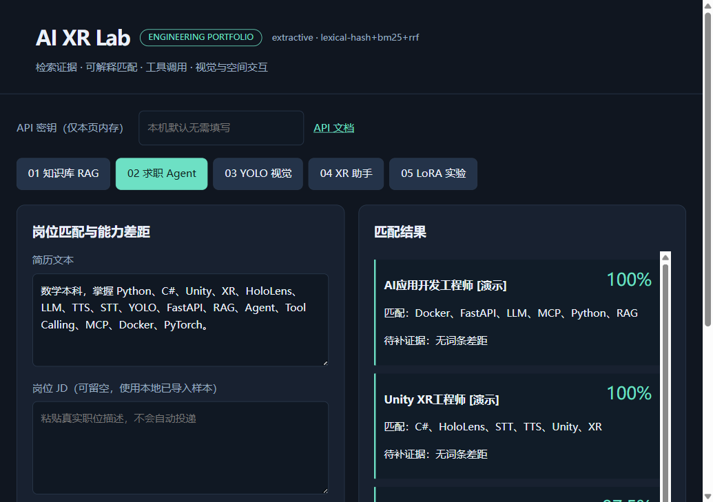

# AI XR Portfolio

五个可在本机运行的 AI 工程项目，共用 FastAPI 后端、SQLite 数据层和浏览器演示界面；另附可构建的 Unity 2022 客户端。项目关注检索证据、模型工具调用、训练评估和跨端交互。

[查看持续集成结果](https://github.com/AQI2022/ai-xr-portfolio/actions)

这是 2026 年 9 月实现的 AI 辅助开发个人作品集，不是商业上线案例。默认无需 API Key；默认的证据摘录模式不冒充大模型。切换本地 Qwen 或兼容模型服务后使用真实生成与工具规划。

## 项目入口

1. [XR 技术知识助手](projects/01-xr-rag/README.md)：PDF/DOCX 解析、分块、BGE 向量检索、BM25、RRF、重排和可定位引用。
2. [AI 求职分析 Agent](projects/02-job-agent/README.md)：技能证据、结构化岗位匹配、差距分析、模型工具调用与 MCP。
3. [垃圾目标检测](projects/03-waste-detection/README.md)：TACO 数据准备、YOLO 训练验证、图像检测 API 和前端标注框。
4. [AI XR 多模态助手](projects/04-xr-multimodal-agent/README.md)：图像检测上下文、STT/TTS、Qwen、记忆、人工确认、Unity 场景动作。
5. [Qwen LoRA 微调](projects/05-lora-finetuning/README.md)：回答区间掩码、真实训练、独立验证、适配器保存重载和推理。



## 5 分钟运行基础演示

Python 3.11 或 3.12。在全新虚拟环境运行，避免与已有音频/深度学习依赖冲突。

```powershell
git clone https://github.com/AQI2022/ai-xr-portfolio.git
cd ai-xr-portfolio
python -m venv .venv
.venv\Scripts\Activate.ps1
python -m pip install -e ".[dev,mcp]"
python scripts/seed_demo.py
python -m uvicorn ai_xr.api:app --host 127.0.0.1 --port 8000
```

打开 <http://127.0.0.1:8000>；交互 API 文档位于 `/docs`。Linux/macOS 使用 `source .venv/bin/activate`。种子内容是自行编写的知识片段和明确标记的虚构岗位，不含个人简历或真实客户资料。

初次演示：知识库提问 → 岗位分析 → XR 助手中旋转立方体 → 点击确认。完整模型模式见下文。

## 启用本地真实模型

```powershell
python -m pip install -e ".[ml,speech]"
python scripts/download_models.py --qwen --embedding --reranker
$env:AI_PROVIDER="transformers"
$env:AI_LOCAL_MODEL="models/qwen2.5-0.5b-instruct"
$env:AI_EMBEDDING_MODEL="models/bge-small-zh"
# 重排可选；本例模型主要面向英文，中文效果应单独评估
$env:AI_RERANKER_MODEL="models/ms-marco-reranker"
python -m uvicorn ai_xr.api:app --host 127.0.0.1 --port 8000
```

需要数 GB 磁盘及足够内存。模型加载和首次推理比后续请求慢。没有独立 GPU 也能运行已验证的 CPU 路径。`--qlora` 是可选实验入口，本次未验证 CUDA 量化训练。

远程模型：复制 `.env.example` 为 `.env`，设置 `AI_PROVIDER=compatible`、`AI_LLM_BASE_URL`、`AI_LLM_MODEL`、`AI_LLM_API_KEY`。接口为兼容 Chat Completions 的 `/chat/completions`；VLM 还要求服务支持图像输入。不要提交 `.env`。文档和简历内容会发送至所配置服务，请先评估隐私。

## 验证与实际结果

```powershell
pytest -q
ruff check ai_xr experiments scripts tests
python experiments/evaluate_rag.py
python experiments/evaluate_rag.py --embedding models/bge-small-zh --reranker models/ms-marco-reranker
python scripts/verify_models.py
python experiments/finetune.py --steps 24
```

原始报告位于 [evidence](evidence/)，包括失败案例与修复后复测。指标只对应记录的数据规模和环境：

- 自编 6 篇资料、12 个问题：混合检索加重排的文档 Recall@3 为 1.0，MRR@3 为 0.9583。词法基线同样 Recall@3=1.0，因此不能据此声称重排优于基线，也不能称为问答正确率。
- Qwen2.5-0.5B-Instruct：32 条训练资料中依次使用前 24 条执行 24 次更新，8 条独立验证资料；验证 token 加权损失从 4.2027 降至 3.6678，保存重载 logits 最大绝对差为 0。样本生成仍有事实不精确与截断，不代表通用能力提升。
- TACO 微型数据集：24 张训练、8 张验证。3 epoch 基线 mAP50 为 0；40 epoch 的 mAP50 为 0.0671、Recall 为 0.0625，仍不足以支持实用垃圾分类。代码交付的是可复现训练和检测系统，不是高精度量产模型。
- 本地 Qwen 实际产生场景旋转工具调用并进入人工确认；系统 TTS 生成的英语音频经 Whisper 转写成功。小模型曾漏引用，已增加引用校验失败后退回原文证据的保护。
- Unity 2022.3.13f1c1 已完成 Windows 构建。未在本次工作中验证 HoloLens/OpenXR 真机、空间锚点或手势追踪。

Unity 实际播放器另通过自动 HTTP 联调：确认前物体角度不变，确认后旋转 45°，详见 `evidence/unity-build.json`。该测试使用无图形模式，不等同于渲染或头显验收。

## 部署

```powershell
docker compose up --build
```

Compose 只绑定本机回环地址。容器默认不含 ML/音频依赖，用于基础 API 演示。Docker 构建与基础接口测试由 GitHub Actions 验证；系统 TTS 在 Linux 容器中还需要语音引擎，不能假定安装 Python 包即可发声。生产部署需要 TLS、用户级权限、资源配额、持久化备份与监控，本作品集未提供完整多租户隔离。

## 结构与安全边界

`ai_xr/` 是应用；`tests/` 是隔离测试；`experiments/` 是真实实验；`scripts/` 提供模型/数据准备和端到端检查；`unity/XRPortfolio/` 是 Unity 源工程。

上传限制为 10 MB，DOCX 解压尺寸受限。扫描 PDF 需要额外 OCR。场景操作只有有限白名单，确认票据按会话绑定、5 分钟过期、单次消费。没有任意 Python、Shell、文件写入或自动投递工具。`AI_APP_API_KEY` 可保护 API，但共享密钥不是多用户权限系统。

浏览器语音识别由浏览器实现，可能使用其远程服务，须用户主动授权；服务端 Whisper 可在模型下载后本地运行。系统 TTS 不等于声音克隆，本仓库没有附带声音克隆模型、参考音色或他人声音。

## 许可与复用

仓库原创代码采用 AGPL-3.0-only，见 [LICENSE](LICENSE)。第三方库、模型和数据保留各自许可，见 [THIRD_PARTY_NOTICES.md](THIRD_PARTY_NOTICES.md)。模型权重、TACO 照片、上传文件、Unity 构建缓存和个人信息均未纳入 Git。
